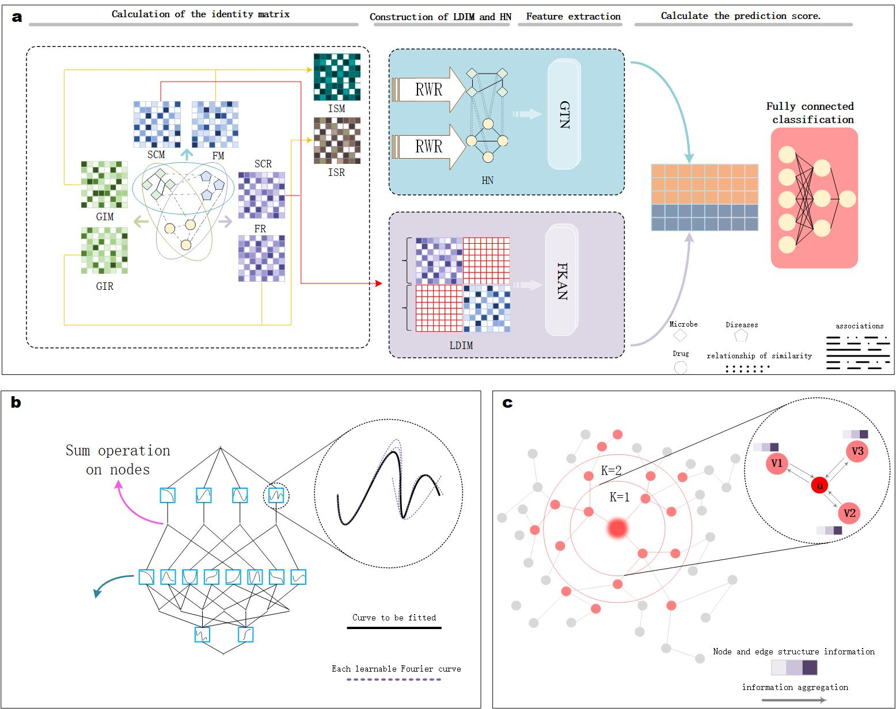

# GTFKAN：A novel microbe-drug association prediction model based on Graph Transformer and Fourier Kolmogorov-Arnold Networks
## Introduction
This repository contains a PyTorch implementation of the GTFKAN framework, as described in the paper ‘A novel microbe-drug association prediction model based on Graph Transformer and Fourier Kolmogorov-Arnold Networks’. GTFKAN is a deep learning framework based on Graph Transformer and Fourier Kolmogorov-Arnold Networks.
## Framework

## System Requirements
The source code developed in Python 3.8.13 using PyTorch 1.12.1. The required python dependencies are given below. GTFKAN is supported for any standard computer and operating system (Windows/macOS/Linux) with enough RAM to run. There is no additional non-standard hardware requirements.

```
torch 1.12.1
numpy 1.24.4
keras 2.9.0
scipy 11.10.1
einops 0.8.0
utils 1.0.2
pandas 1.3.5
scikit-learn 1.3.2
torch_geometric 2.2.0
torch_scatter 2.0.9
tensorflow 2.9.1
```


## Data sets
The `datasets` folder contains all the experimental data used by GTFKAN: [MDAD](http://chengroup.cumt.edu.cn/MDAD) and [aBiofilm](http://bioinfo.imtech.res.in/manojk/abiofilm/). In the `data/MDAD` and `data/aBiofilm` folders we have complete data on microbes, drugs and diseases.


### Data description
Folder MDAD:<br>
```
adj/adj21:interaction pairs between microbes and drugs
ptr:sum of microbe and drug node counts
drug_microbe_matrix: known microbe-drug associations
known:known microbe-drug association indexs
unknown:unknown microbe-drug association indexs
drug_similarity: drug functional similarity
microbe_similarity: microbe functional similarity
```


## Run GTFKAN on our data to reproduce results
In order to train GTFKAN, you need to modify the corresponding database paths and parameters in advance. Just run ‘main.py’ after modification.


## Use our code in a new database
If you are going to use our code on a new database, you need to prepare the microbe, drug and disease associations in advance. You can choose to run ‘Calculation_of_composite_similarity.py’ in advance to get drug functional similarity or microbe functional similarity. also You can also calculate functional similarity every time you run the main code. to reduce time complexity, we recommend running ‘Calculation_of_composite_similarity.py’ in advance. The next thing you need to do is to replace the read path of each file in the code with the path to the new database file. Then you also need to update the corresponding parameters in the code. For example, in ‘main.py’, replace 1373 (microbial species) and 173 (drug species) with the species in the new database.

